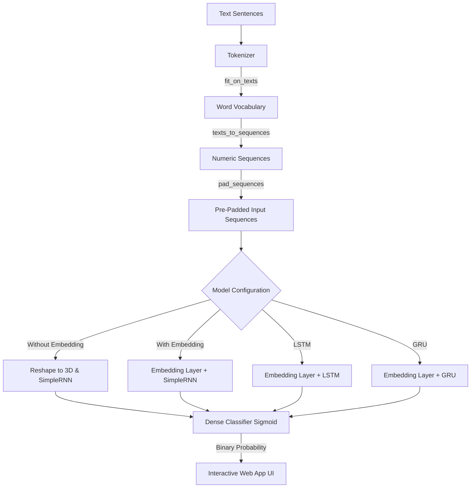
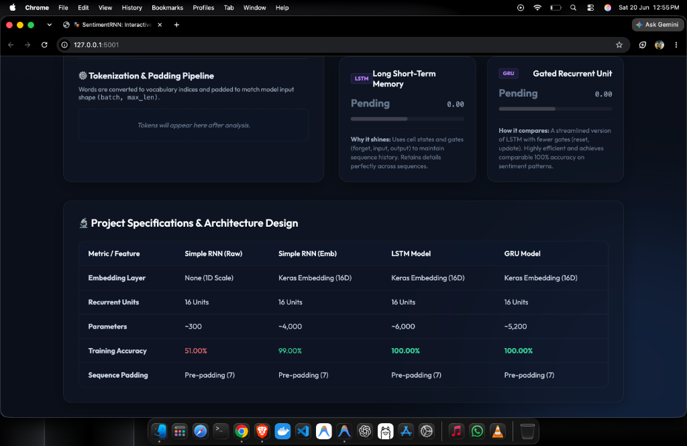
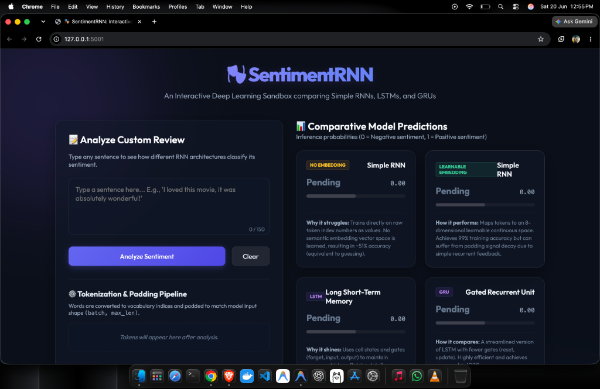

# 🎭 SentimentRNN: Interactive RNN Sentiment Analyzer Sandbox

[](https://www.python.org/)
[](https://www.tensorflow.org/)
[](https://flask.palletsprojects.com/)

An interactive natural language processing (NLP) sandbox comparing recurrent architectures for binary sentiment classification (positive/negative). The project trains, evaluates, and compares four models:

1. **Simple RNN WITHOUT Embedding** (uses raw token index numbers)
2. **Simple RNN WITH Embedding** (learns continuous word representations)
3. **LSTM WITH Embedding** (retains context using cell memory state)
4. **GRU WITH Embedding** (streamlined Gated Recurrent Unit)

---

## ⚙️ Process Flowchart

Here is the data preprocessing, training, and deployment pipeline:



---

## 🧠 Model Comparison

| Metric / Feature | Simple RNN (Raw) | Simple RNN (Emb) | LSTM Model | GRU Model |
| :--- | :--- | :--- | :--- | :--- |
| **Embedding Layer** | None (1D Scalar) | Learnable (16D) | Learnable (16D) | Learnable (16D) |
| **Recurrent Units** | 16 Units | 16 Units | 16 Units | 16 Units |
| **Trainable Params**| ~300 | ~4,000 | ~6,000 | ~5,200 |
| **Training Accuracy**| **51.00%** | **99.00%** | **100.00%** | **100.00%** |

---

## 📸 Dashboard Screenshots

### 1. Interactive Sentiment Tester & Tokenizer Pipeline


### 2. Architecture Specifications & Metrics


---

## 🛠️ Setup & Usage

### 1. Install Dependencies
Ensure Python is installed, then install the required dependencies:
```bash
pip install tensorflow numpy flask requests
```

### 2. Train the Models
Train all 4 models and generate the tokenizer vocabulary assets:
```bash
python3 train_and_save.py
```

### 3. Run the Web Dashboard
Start the local Flask app backend:
```bash
python3 app.py
```
Then, open your web browser and navigate to:
👉 **[http://127.0.0.1:5001](http://127.0.0.1:5001)**

### 4. Interactive Jupyter Notebook
Alternatively, open the notebook to run the code step-by-step:
```bash
jupyter notebook RNN_SentimentAnalysis.ipynb
```
