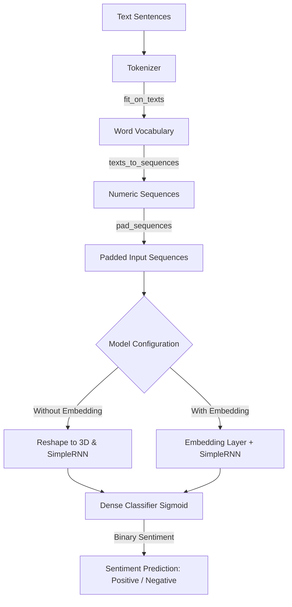

# 🎭 RNN Sentiment Analysis

[](https://www.python.org/)
[](https://www.tensorflow.org/)
[](https://keras.io/)
[]()

A recurrent neural network project demonstrating text sentiment classification (positive/negative) using Keras and TensorFlow. The project implements and compares two architectures:
1. **Simple RNN WITHOUT Embedding** (uses raw index sequences)
2. **Simple RNN WITH Embedding** (learns continuous word representations)

---

## ⚙️ Process Flowchart

Here is the step-by-step pipeline representing data processing, tokenization, model training, and prediction:



---

## 🧠 Model Architectures

### 1. RNN WITHOUT Embedding
- **Input:** Padded sequences reshaped into 3D tensors `(batch_size, sequence_length, 1)`.
- **SimpleRNN Layer:** 10 recurrent units processing sequences step-by-step.
- **Dense Layer:** 1 unit with Sigmoid activation for binary classification.

### 2. RNN WITH Embedding
- **Input:** Padded sequences of shape `(batch_size, sequence_length)`.
- **Embedding Layer:** Projects discrete token indices to an 8-dimensional continuous vector space.
- **SimpleRNN Layer:** 10 recurrent units processing the embedding vectors.
- **Dense Layer:** 1 unit with Sigmoid activation.

---

## 📈 Training Performance

- **Dataset:** Small illustrative corpus of positive and negative sentiment sentences.
- **Optimizer:** Adam
- **Loss Function:** Binary Crossentropy
- **Performance:** Both models easily learn the training sentences perfectly (100% accuracy) and generalization differences are explored using out-of-distribution test sentences.

---

## 🛠️ Setup & Usage

### 1. Install Dependencies
Make sure Python is installed, then install the required dependencies:
```bash
pip install tensorflow numpy
```

### 2. Run the Notebook
Open the notebook and execute the cells:
```bash
jupyter notebook RNN_SentimentAnalysis.ipynb
```
